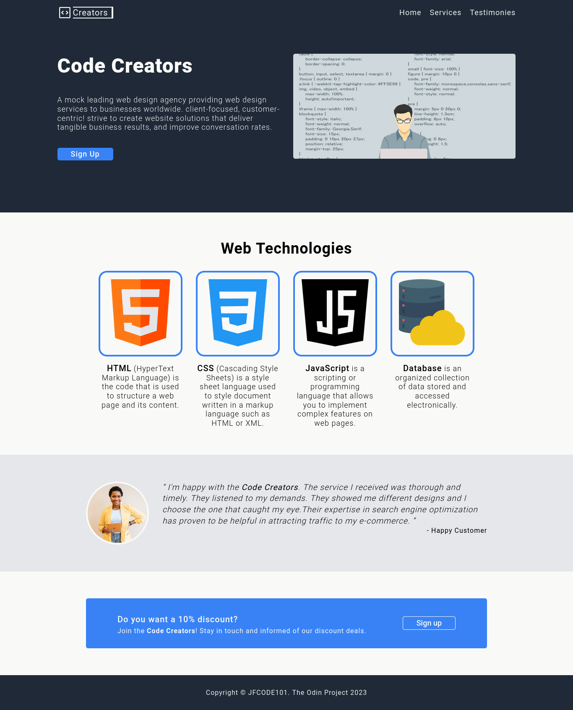
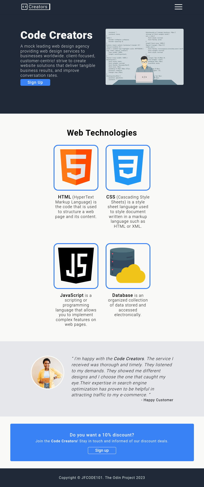

# Landing-Page

This is a simple Landing Page project created using HTML and CSS

## Table of Content

-[Overview](#overview)
    -[The challenge](#the-challenge)
    -[Screenshots](#screenshots)
    -[Links](#links)
        -[Code](#code)
        -[Images](#images)
        -[Icons](#icons)
-[Author](#author)

## Overview

### The challenge

Overall this was a simple project, the only challenge was to look at the design and figure out the measurements in terms of width and heights.

### Screenshots

- Desktop screenshot: 
- Tablet screenshot: 
- Mobile screenshot: 

### Links

#### Code

- Source code: [Github](https://github.com/jfcode101/Landing-Page)
- Live site: [Github page](https://jfcode101.github.io/Landing-Page/index.html)

#### Images

- Hero image: [pixabay](https://pixabay.com/vectors/programmer-programming-code-work-1653351/)
- Testimonial image: [Alex Stanes](https://unsplash.com/photos/PK_t0Lrh7MM)

#### Icons

- HTML: [Flaticon - created by Freepik](https://www.flaticon.com/free-icons/html)
- CSS: [Flaticon - created by Pixel perfect](https://www.flaticon.com/free-icons/css)
- JavaScript: [Flaticon - created by edt.im](https://www.flaticon.com/free-icons/javascript)
- Database: [Flaticon - created by Smashicons](https://www.flaticon.com/free-icons/database)

### Author

- Github: [JFcode101](https://github.com/jfcode101/)
